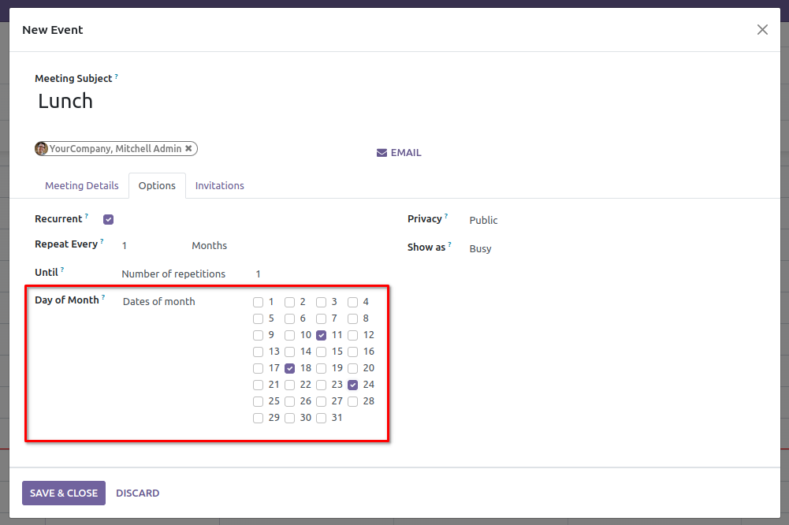
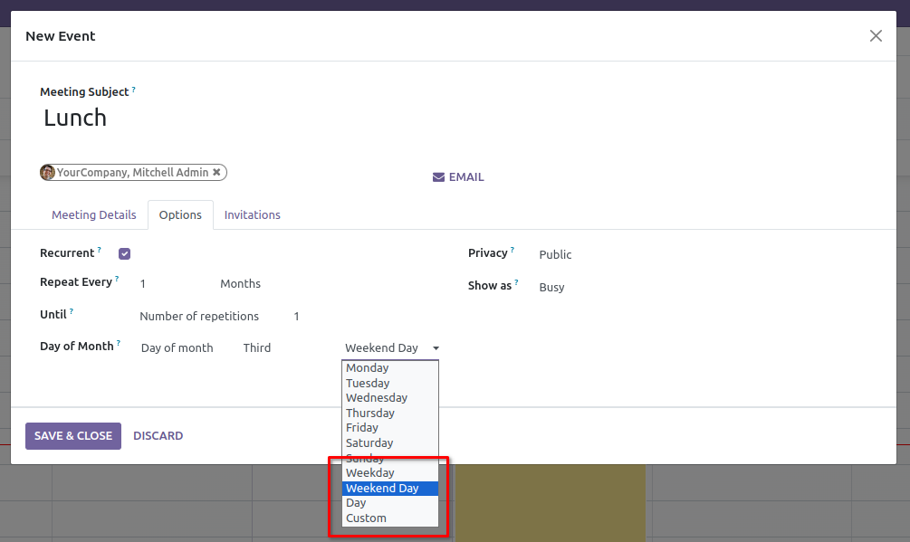

To use this module, you need to:

1. Go to the calendar app;
2. create a new event;
3. on the form of the event check "Recurrent" and select "Monthly".
4. Select "Dates of month":
    or select "Day of
   month" and "Weekday", "Weekend Day", "Day" or "Custom":
   
